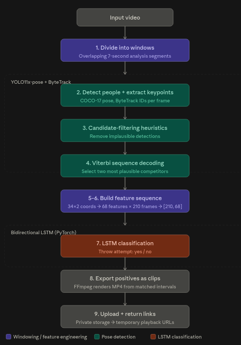
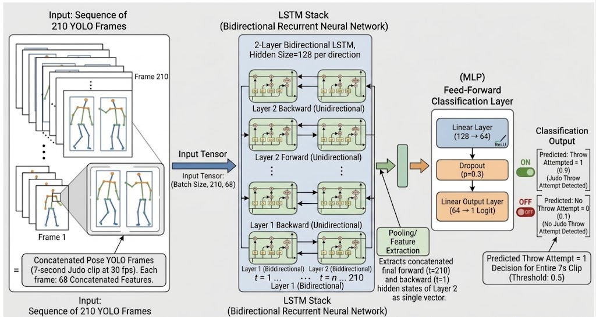

- [Live Application](https://www.judoclipper.com)
- [Backend Repository](https://github.com/Coshea46/ai-judo-coach-system)
- [Model Research Repository](https://github.com/Coshea46/ai-judo-coach-research-clean)
- [Final V1 Model Report](/blog/judo-clipper/v1-classification-model-reports/final-v1-model)

*The frontend was implemented with substantial generative AI assistance, so this write-up
focuses on the model research, processing pipeline and backend engineering that I developed
directly.*

---

## Key Results

| Metric                        | Value                                             |
| ------------------------------ | -------------------------------------------------- |
| Labelled dataset               | 2,163 seven-second clips                          |
| Final model performance        | 0.761 attempt F1, 0.808 macro F1 (held-out test) |
| Representative full-match run  | 402 seconds processed in 539 seconds              |
| Backend automated tests        | 554 tests passing                                 |
| Maximum video duration         | 30 minutes                                        |

---

## Problem and Motivation

As someone who trains and competes in judo with my university club, I noticed that as the
club grew past 100 members, our two coaches were increasingly unable to review match footage
for everyone.

This problem has two stages:

1. **Finding moments worth reviewing:** surfacing likely throw attempts automatically so
   coaches don't have to scrub through full matches.
2. **Providing feedback on those moments:** explaining why an attempt succeeded or failed.

Judo Clipper currently addresses stage one. Stage two is a longer-term research direction
and is not part of the current application.

---

## Design Decisions and Scope Pivot

### The Original Idea

Judo Clipper began as a coaching tool aimed at a more specific problem than post-match review: spotting missed opportunities to throw. The idea was that if a model could predict, from the previous seven seconds of fighting, whether a throw attempt was about to happen, it could also flag the inverse case, moments where the conditions for an attempt were present but the athlete didn't take them. That kind of missed opportunity is difficult for a coach to catch by eye across dozens of matches, but potentially valuable feedback for a competitor.

The task was framed as: given the previous seven seconds of fighting, predict whether a throw attempt will happen next.

### Why It Didn't Hold Up

Several problems emerged as the forecasting approach was developed further.

Defining the forecast horizon itself was difficult. A fixed future window either cut off in the middle of a developing attempt or left too much ambiguity about what counted as a correct prediction when an action straddled the boundary between the observed and predicted periods.

There were also doubts about whether pose keypoints alone contained enough information to support this. Spotting a missed opportunity requires judging not just movement, but grip fighting, balance and tactical intent, in order to say that a throw should plausibly have happened at a given moment. It wasn't clear that COCO-17 keypoints captured enough of that signal to make this kind of judgement reliably, as opposed to recognising an attempt that had already visibly occurred.

The available dataset was also limited, and forecasting, particularly forecasting an absence, is inherently harder to learn from a fixed amount of data than classifying a completed action, since the model has less direct evidence to work from.

Finally, and most practically, this framing wasn't the best fit for the broader post-match review problem I was also trying to solve. Coaches reviewing footage after a match don't primarily need a system that judges missed opportunities in real time, they need one that reliably finds moments that already happened and are worth watching. This use case is intrinsically after the fact, which meant the constraints that made the forecasting approach fragile were also solving a narrower problem than the one with the clearest immediate value.


### The Pivot

Given these constraints, I redefined the task as: given a completed seven-second clip, classify whether it contains at least one throw attempt.

This re-framing removed the horizon-definition problem entirely, since the model only ever needs to reason about a fixed, fully observed window rather than an uncertain future one. It also matched the dataset better, since classifying a completed action is a more tractable learning problem than forecasting an unseen one, especially at the scale of data available. Most importantly, it matched the actual use case: post-match review doesn't need foresight, it needs accurate retrospective detection.

This was a deliberate scope change based on what the data, the task difficulty and the real use case supported, rather than an abandonment of the original idea. The missed-opportunity concept remains a plausible direction if a larger and more detailed dataset became available in future, but it was not the right starting point given the constraints at the time.


---

## Demo

The video below demonstrates the Judo Clipper workflow, from submitting match
footage to receiving likely throw-attempt clips for review.

<figure className="video-demo">
  <video controls preload="metadata" playsInline>
    <source
      src="https://media.conoroshea.dev/judo-clipper/judoclipper_demo_with_captions.mp4"
      type="video/mp4"
    />
    Your browser does not support embedded HTML video.
  </video>

  <figcaption>
    Judo Clipper processing match footage and returning likely throw-attempt clips.
  </figcaption>
</figure>

---


## How It Works

Judo Clipper combines two machine-learning components:

- **Ultralytics YOLO11x-pose with ByteTrack** detects people, extracts COCO-17 pose keypoints
  and associates detections across frames using persistent track IDs. Judo footage contains
  frequent occlusion as competitors overlap, so frame-level detections can temporarily
  disappear or become unreliable. ByteTrack provides temporal continuity between detections,
  while a separate heuristic and Viterbi-based player-selection system determines which
  tracked poses most plausibly belong to the two competitors.

- **A custom bidirectional LSTM**, implemented in PyTorch, classifies whether a completed
  seven-second pose sequence contains at least one likely throw attempt. I selected an LSTM
  because the task depends on movement over time and the available dataset contains 2,163
  labelled clips. Its relatively compact architecture was a better fit for the available data
  and compute than starting with a larger transformer-based model. Transformer architectures
  were not evaluated, so this was a design decision rather than a measured comparison.

### Processing Pipeline

The complete processing pipeline is:

1. Divide the input video into overlapping seven-second analysis windows.
2. Run YOLO11x-pose with ByteTrack to detect people, extract COCO-17 pose keypoints and
   associate detections across frames.
3. Apply candidate-filtering heuristics to remove implausible competitor detections.
4. Use Viterbi-based sequence decoding to select the most plausible competitor poses
   throughout each window.
5. Flatten each selected COCO-17 pose into 34 coordinate features and concatenate the two
   competitors, producing 68 features per frame.
6. Stack 210 frames to create one `[210, 68]` input sequence for each seven-second window.
7. Pass each sequence through the bidirectional LSTM to classify whether the window contains
   at least one likely throw attempt.
8. Retain positively classified windows and convert the corresponding intervals into MP4
   clips using FFmpeg.
9. Upload the generated clips to private storage and return temporary playback links to
   the user.



### System Architecture

Judo Clipper uses an asynchronous, serverless architecture that separates the
web application, private video storage and resource-intensive processing.

A FastAPI control plane manages job creation, submission and status, while
specialised Modal workers perform video cleansing, distributed GPU inference
and clip generation. Amazon S3 provides shared private storage for source
videos, temporary processing artefacts and generated clips.

<pre className="mermaid">{`flowchart TB
    WEB["Browser application<br/>Deployed with Vercel"]
    MODAL["Control and compute<br/>FastAPI and Modal workers"]
    S3[("Object storage<br/>Private Amazon S3 bucket")]

    WEB <-->|"Job control, status and clip links"| MODAL
    WEB <-->|"Direct uploads and clip playback"| S3
    MODAL <-->|"Read and write video artefacts"| S3

    classDef web fill:#eaf4ee,stroke:#176b4a,color:#17201c,stroke-width:2px
    classDef compute fill:#eef3fb,stroke:#426fa6,color:#17201c,stroke-width:2px
    classDef storage fill:#fff7e5,stroke:#b68112,color:#17201c,stroke-width:2px

    class WEB web
    class MODAL compute
    class S3 storage`}</pre>

#### Browser Application

The browser application is a Next.js frontend responsible for the parts of the workflow that involve the user directly. It:

- accepts an uploaded MP4 or lets the user select a built-in example video;
- validates file type, duration and size before upload;
- uploads files directly to S3 rather than through the backend;
- submits the uploaded job for processing;
- polls job status until processing completes or fails;
- plays back generated clips once they are available.

As noted at the top of this write-up, the frontend was implemented with substantial generative AI assistance, so this section describes its role in the system rather than its implementation.

#### FastAPI Control Plane

FastAPI itself is deployed as a Modal application, running on Modal's serverless CPU compute rather than on separate infrastructure. The GPU processing workers run as separate Modal functions, so the "control plane" and "processing workers" split is a division of responsibility within the codebase, and of compute type, rather than a split across different hosting platforms.

The API exposes:

- `GET /health`
- `POST /jobs`, which returns a job ID and presigned S3 POST instructions for direct upload
- `POST /jobs/{job_id}/submit`, called once the browser has uploaded the file directly to S3
- `GET /jobs/{job_id}`, used for status polling
- `POST /examples?example=short` and `POST /examples?example=full`, which start processing on the two built-in example videos
- preview endpoints for both examples

Each job moves through the states `awaiting_upload`, `processing`, `completed` and `failed`.

FastAPI creates a UUID for each job, returns presigned upload instructions, and verifies that the uploaded input exists before starting processing. Job records are stored in a `modal.Dict`, which the control plane checks during polling to determine whether the underlying Modal call has completed. On completion, it generates temporary presigned URLs for clip playback. On failure, it returns a safe, generic failure message rather than internal error detail.

Video data never passes through FastAPI. Uploads go directly from the browser to S3, and clips are served back to the browser the same way.

#### Modal Processing Workers

Video processing runs as a set of Modal functions: a processing coordinator, a GPU cleansing worker, and up to four GPU window-processing groups.

The cleansing worker runs first. It downloads the source video, removes its audio track, normalises the frame rate, constructs the ordered list of analysis-window work items, and uploads a single shared cleansed video to S3 for the other workers to use.

Each GPU worker then downloads that shared cleansed video and processes one contiguous group of windows, running pose inference, tracking, player selection and LSTM classification for its assigned windows. It returns its results as ordered primitive values along with timing information, rather than returning video data.

The coordinator partitions the work into up to four groups, launches the GPU workers, and downloads its own copy of the cleansed video while their inference runs, so that the coordinator's own I/O overlaps with worker computation rather than happening afterwards. Once workers return, the coordinator validates and restores the correct result ordering, generates clips with FFmpeg from the positively classified windows, uploads the clips to S3, and deletes the temporary cleansed video object.

#### Amazon S3 Storage

A private S3 bucket provides shared storage across the system. It holds the built-in example videos, uploaded source videos, temporary cleansed videos produced during processing, and the final generated clips.

The browser uploads directly to S3 using presigned POST instructions returned by FastAPI, and plays back clips using temporary presigned URLs, so the bucket itself never needs to be public. Temporary cleansed video objects are deleted by the coordinator once processing completes, so only source videos, examples and generated clips persist.

As a fallback, all job-related objects are automatically deleted from S3 after 7 days, regardless of whether the job completed successfully.

### Upload and Job Lifecycle

For a user-uploaded video, the browser and backend communicate through the following sequence:

1. The browser validates the file locally (type, duration, size).
2. The browser requests a new job from FastAPI.
3. FastAPI returns a job ID and presigned S3 POST instructions.
4. The browser uploads the video directly to S3 using those instructions.
5. The browser submits the job for processing.
6. FastAPI verifies that the uploaded object exists in S3.
7. FastAPI starts the Modal processing pipeline described above.
8. The browser polls job status until it reports `completed` or `failed`.
9. On completion, FastAPI returns temporary presigned clip URLs.
10. The browser plays the clips directly from S3.

Example jobs follow the same pipeline but skip the browser upload step. The backend copies the selected example video into a new job's input location and starts processing as normal from step 6 onwards.

---

## Identifying the Two Competitors

### Why YOLO and ByteTrack Were Not Enough

YOLO11x-pose detects people and extracts pose keypoints on a per-frame basis, and ByteTrack associates those detections across frames using motion and position, assigning each detected person a persistent track ID. Neither of these on their own determines which two tracked people in the frame are the actual competitors, as opposed to a referee, coaches, or spectators near the mat.

ByteTrack's association is based on the movement and position of detections between frames, not on visual appearance, so it cannot be relied on to re-identify a specific person after their track is lost. Judo involves frequent and severe occlusion, competitors grip, turn and fall on top of one another throughout a match, so detections and tracks can temporarily disappear or become unreliable, and a track ID that briefly vanishes during a throw is not guaranteed to be reassigned to the same person when it reappears. Determining which two tracked people are the competitors, and keeping that identification consistent through occlusion, therefore had to be solved separately.

### Initial Colour-Based Approach

The first approach to this problem, built in February and March, used judogi colour on top of the existing YOLO and ByteTrack pipeline. For each detected person, colour was sampled from the frame region around a set of upper-body and leg keypoints (shoulders, elbows, hips and knees), and each detection was classified as either a white or blue judogi based on that sample.

Since more than one detected person could be classified as the same colour in a given frame, for example a referee or spectator with clothing that matched, average body length across a fixed set of keypoints was used as a tiebreaker within each colour group, with the largest candidate of each colour selected as that frame's white or blue player. This relied on the two competitors typically appearing larger in frame than bystanders.


### Problems with Colour-Based Identification

This approach was replaced because it was unreliable across the conditions actual match footage presented.

Lighting and shadows altered the colours the model actually observed, so a judogi could be sampled as a different colour than its true one depending on where a competitor stood on the mat or how they were lit. Video compression and partial occlusion during grips and throws further degraded the reliability of any single colour sample. The approach also didn't generalise well across different recording environments, footage varied in camera angle, mat colour and lighting setup, all of which affected how consistently colour classification behaved from one match to another.

Most significantly, the approach failed structurally whenever both competitors wore the same colour judogi. In formal competitions this is very rare, since coloured belts are typically assigned to avoid it, but it happens routinely in club training sessions, where two athletes sparring will often both be wearing plain white judogi. Since the actual motivating use case for Judo Clipper includes reviewing training footage from my own club, not just formal competition, this wasn't an edge case that could be dismissed. In that situation, colour carries no information at all about which detection belongs to which competitor, so the method couldn't function regardless of tuning.


### Viterbi-Based Player Selection

Given the problems with colour-based identification, player selection was reframed as a most-likely-path problem. Rather than labelling the two competitors in each frame independently, the question becomes: across the whole clip, what is the single most likely sequence of role assignments, given how plausible each candidate looks per frame and how consistent successive assignments are with each other? Viterbi decoding fits this directly, since it finds the best-scoring path through a sequence of states rather than optimising each frame alone.

The state itself is the joint decision: which detected person, if any, plays each competitor role in a given frame. Identity and selection are resolved together, not as separate steps.

There is no hard pre-filter removing referees, coaches or spectators before decoding runs; every detected person is a valid candidate. Implausible candidates are discouraged through scoring instead. Each frame contributes a local score based on how plausible each candidate looks individually (position, pose size, detection and keypoint confidence) and how plausible the pair looks together (bounding-box overlap and keypoint proximity, since competitors tend to be close to one another). A separate transition score compares consecutive frames, rewarding a role that keeps the same ByteTrack ID and penalising large positional jumps. This is the standard emission/transition split, kept deliberately separate so a frame's plausibility never depends on the previous frame's outcome.

A frame with too few reliable candidates isn't forced to produce two competitors. Leaving a player unassigned is itself a valid, scored outcome. Short gaps of up to five frames are filled by linear interpolation between the nearest valid detections either side. Longer gaps, or gaps at the start or end of a clip, are left unresolved, and a clip with too many unresolved frames for either player is rejected outright.

This is a meaningful improvement over frame-by-frame colour matching. It reasons about a whole clip rather than one frame, tolerates ByteTrack losing or switching track IDs, and doesn't depend on judogi colour at all.

It also has a known limitation. Identity is only reliably stable while tracking is stable, since the transition score only ever compares one frame to the next, with no longer-memory check against how a player has looked across the whole clip. During a genuine clinch or crossing, exactly when ByteTrack itself is prone to losing or swapping IDs, a full swap of which detection is labelled player A and which is player B can cost about the same as continuing correctly. This doesn't affect the binary label a clip receives, so it hasn't blocked the classifier's development, but it remains an open problem for any future work needing consistent per-player identity across a clip.


### Building the Classifier Input

Once Viterbi-based player selection has produced a sequence of pose assignments for the two competitors across a clip, that sequence still needs to be converted into a fixed numerical shape the LSTM can consume.

Each competitor's pose is represented as 17 COCO keypoints, using YOLO11x-pose's normalised keypoint coordinates rather than raw pixel positions, flattened to x and y values to give 34 coordinate features per player per frame. The two players' 34-value vectors are concatenated, player A followed by player B, into a single 68-value vector per frame. No confidence values are included, only coordinates. Frames where a player's pose couldn't be resolved, even after the short-gap interpolation described earlier, carry that missing state through to this final step, any coordinate still unresolved at this point is set to zero, but only here, not earlier in the pipeline. Repeating this across all 210 frames of a seven-second, 30fps clip produces one `[210, 68]` sequence, the exact input shape the LSTM classifier expects.

This means the model never sees raw pixels. Its entire view of a clip is this sequence of joint coordinates for two people over time, which is why the reliability of the upstream detection, tracking and player-selection stages directly determines the quality of what the classifier receives.

---

## Developing the Classification Model

{/* Diagrams (training loss curves, additional architecture diagrams) are treated as
     report-only content and are not embedded on the main page, aside from the final
     architecture diagram included below. */}

### Dataset and Labelling

The dataset was built from full judo matches scraped from YouTube, mainly team events, since each video typically contained four or five individual matches and reduced the number of separate sources needed.

Throw attempts were labelled by hand. To keep labelling decisions consistent, I focused on clearly identifiable, high-amplitude throwing techniques such as drop seoi nage, tomoe nage, uchi mata, osoto gari and ouchi gari, rather than attempting to capture every technique that could plausibly count as an attempt. Smaller or more ambiguous techniques such as kouchi gari were occasionally included but were not the primary focus, since they are harder to identify unambiguously as a genuine attempt from footage alone. Labelling was carried out entirely by me and took approximately 50 to 60 hours in total.

Positive clips were extracted with FFmpeg using a script that reads each labelled throw timestamp and cuts a fixed seven-second, 30fps window ending shortly after the throw, with a randomised offset before the throw so that its position within the clip varies. Negative clips were generated with a separate script that scans each source video for windows that do not overlap with any labelled throw, using an exclusion buffer either side of each throw timestamp, and samples valid seven-second windows from the remaining footage.

The dataset consists of 2,163 labelled seven-second clips: 1,390 with no throw attempt and 773 containing at least one. The dataset was split into training, validation and test sets using scikit-learn with a fixed random seed of 42, and the resulting assignments were frozen to a manifest file so that every experiment trained and evaluated on exactly the same clips.

| Split | No attempt | Attempt | Total |
|---|--:|--:|--:|
| Training | 1,112 | 618 | 1,730 |
| Validation | 139 | 77 | 216 |
| Test | 139 | 78 | 217 |

The split is stratified by class at clip level, not grouped by source match. Clips from the same bout may therefore appear across different splits, so the held-out test results discussed later cannot be taken as evidence of performance on entirely unseen matches. This limitation is revisited in [Limitations](#limitations).


### Baseline Model

The baseline is a two-layer unidirectional LSTM with a feed-forward classification head, taking the `[210, 68]` pose sequence described above and producing one logit for the whole clip. It was trained for 50 epochs with the Adam optimiser, a learning rate of 0.001 and weight decay of 0.0001.

The best checkpoint, selected by lowest validation loss, occurred at epoch 42. At its validation-selected threshold of 0.53, the baseline achieved:

| Metric | Value |
|---|--:|
| Accuracy | 0.7685 |
| Attempt precision | 0.6421 |
| Attempt recall | 0.7922 |
| Attempt F1 | 0.7093 |
| Macro F1 | 0.7585 |
| False positives | 34 |

The training loss curve showed an erratic spike after epoch 42, which indicated possible training instability rather than a confirmed diagnosis of exploding gradients. Gradient clipping was tested as a controlled intervention in response to this observation.

**Full detail:** [Read the baseline model report](/blog/judo-clipper/v1-classification-model-reports/baseline-model)

### Controlled Experiments

Three further changes were each tested as isolated, controlled experiments against the baseline. Every experiment used the same dataset, the same frozen split, the same seed, a 50-epoch training budget, and the same optimiser, learning rate and weight decay. Best checkpoint selection used the lowest validation loss, and threshold selection used validation attempt F1. The test split was not used at any point during model selection.

| Experiment | Controlled change | Validation attempt F1 | Macro F1 | False positives |
|---|---|--:|--:|--:|
| Original unidirectional baseline | Initial two-layer LSTM | 0.7093 | 0.7585 | 34 |
| Unidirectional with gradient clipping | Maximum gradient norm of 1.0 | 0.7564 | 0.8094 | 20 |
| Bidirectional with gradient clipping | Bidirectional recurrence | 0.7722 | 0.8204 | 20 |
| Bidirectional, clipping and automatic weighting | Positive-class weight of 1.7994 | 0.7950 | 0.8366 | 20 |

**Gradient clipping** produced the largest single improvement. Clipping the gradient norm to a maximum of 1.0 reduced false positives from 34 to 20 and raised attempt F1 from 0.7093 to 0.7564.

**Bidirectionality** was tested next, on the basis that the model always classifies a complete clip after the fact, so there is no reason to restrict it to processing the sequence forward only. This produced a smaller further gain, correctly identifying two additional attempt clips without increasing false positives.

**Automatic positive-class weighting** addressed the class imbalance in the training split (1,112 no-attempt clips against 618 attempt clips) by weighting the loss contribution of attempt-class errors by a factor of approximately 1.7994, calculated from the training split only. This produced the best validation result of the four configurations, correctly identifying three further attempt clips without adding false positives.

**Full detail:**

- [Gradient clipping report](/blog/judo-clipper/v1-classification-model-reports/gradient-clipping)
- [Bidirectional LSTM report](/blog/judo-clipper/v1-classification-model-reports/bidirectional-lstm)
- [Automatic class-weighting report](/blog/judo-clipper/v1-classification-model-reports/automatic-class-weighting)


### Selected Model

The final model is a custom two-layer bidirectional LSTM with a feed-forward classification head, implemented in PyTorch.



| Hyperparameter | Value |
|---|--:|
| Sequence length | 210 |
| Features per frame | 68 |
| LSTM hidden size | 128 per direction |
| LSTM layers | 2 |
| Bidirectional | True |
| Classifier hidden size | 64 |
| Dropout | 0.30 |
| Output | One logit |

It was trained with the Adam optimiser (learning rate 0.001, weight decay 0.0001), a maximum gradient norm of 1.0, and an automatic positive-class weight of 1.7994, using random seed 42. The selected checkpoint, chosen by lowest unweighted validation loss, is from epoch 26. The production classification threshold, chosen by maximising validation attempt F1, is 0.55.

Gradient clipping and class weighting are training-time procedures only. They are not applied when the trained model is used for inference.

**Full detail:** [Read the final V1 model report](/blog/judo-clipper/v1-classification-model-reports/final-v1-model)

### Held-Out Test Evaluation

After model, checkpoint and threshold selection were complete, the selected configuration was evaluated once on the held-out clip-level test split of 217 clips. No further selection was performed based on this result.

| | Predicted: Attempt | Predicted: No attempt |
|---|--:|--:|
| **Actual: Attempt** | 62 (TP) | 16 (FN) |
| **Actual: No attempt** | 23 (FP) | 116 (TN) |

The classifier achieved 0.761 attempt-class F1 and 0.808 macro F1 on a held-out clip-level test split of 217 samples.

Performance on the test split was somewhat lower than on the validation split (attempt F1 0.7950, macro F1 0.8366), which is expected given that the validation split was used for architecture, checkpoint and threshold selection.

**Full detail:** [Read the final V1 model report](/blog/judo-clipper/v1-classification-model-reports/final-v1-model)

---

## Performance Optimisation

### Original Sequential Design

The original deployed pipeline ran the entire job on a single Modal T4 GPU worker, processing every stage serially:

```text
Download source video from S3
→ FFmpeg audio-removal stage
→ FFmpeg 30fps normalisation stage
→ YOLO11x-pose over the whole video
→ ByteTrack, player assignment and classification for every window
→ merge intervals
→ extract clips
→ upload clips to S3
```

Two inefficiencies stood out in this design. First, both FFmpeg cleansing stages (audio removal and frame-rate normalisation) used software encoding without stream-copy, so each stage fully decoded and re-encoded the video, meaning the source video was transcoded twice before any inference began. Second, all 133 seven-second windows for a given video were processed sequentially on the same worker, with clip extraction and upload only starting once every window had finished.

Earlier local development work had already introduced shared pose-detection caching across overlapping windows and reduced player-assignment overhead, removing a separate source of redundant computation. Even with that in place, the deployed pipeline remained a single serial worker end to end, and this is the design the profiling below examines.

### Profiling and Identifying the Bottleneck

The best representative baseline for the original single-worker deployment, processing the full 402-second example match, was 15.68 minutes end to end.

To understand where that time was going, a separate instrumented diagnostic run recorded per-stage timings. This particular run was noisier and slower overall (21.51 minutes total) than the clean baseline, so its absolute numbers should be read as diagnostic evidence of where time was concentrated, not as a stage-by-stage breakdown of the 15.68-minute baseline itself.

| Stage | Time |
|---|--:|
| Download input video | 19.0s |
| Two-stage FFmpeg cleanse | 375.8s |
| Pose-detection inference | 575.7s |
| Window processing | 197.1s |
| Extract final clips | 56.3s |
| Upload generated clips | 31.3s |

Two stages dominated: the two-stage software video cleanse and the pose-detection inference pass, together accounting for the large majority of total processing time. Both were consequences of the original design rather than of the model or algorithm itself, the cleanse was doing full software transcodes rather than using hardware encoding, and pose inference was running on a single GPU worker with no distribution across the video's 133 windows.

This pointed to two concrete interventions: replacing software transcoding with hardware-accelerated encoding, and distributing pose inference across multiple concurrent GPU workers.

### Distributed Processing Redesign

The redesigned Modal pipeline separates orchestration from inference and distributes the expensive GPU work:

```text
CPU coordinator
→ spawn dedicated T4 cleanse worker
→ download source from S3
→ two-stage lossless NVENC cleanse
→ build ordered seven-second window work items
→ upload cleansed video temporarily to S3
→ divide windows into four contiguous groups
→ process groups concurrently on four T4 workers
→ merge ordered results
→ extract final clips
→ upload clips
→ delete temporary cleansed object
```

The cleansing stage retains the same two steps, audio removal and 30fps normalisation, but both now use lossless T4 NVENC hardware encoding instead of software encoding. This was verified against the same two behavioural gates used elsewhere in testing: a known attempt video still produces exactly one valid clip, and a known no-attempt video still produces none.

Pose inference is distributed across four T4 workers, each processing one contiguous group of windows. Each worker downloads the shared cleansed video once, decodes only the frames its group requires, runs YOLO inference in batches, and immediately converts the output to lightweight CPU-side detection records rather than retaining raw frames or full inference results. Each worker creates a fresh ByteTrack instance per window and preserves the classifier's exact `[210, 68]` float32 input contract. Results are returned as small primitive records and merged back into the original window order by the coordinator.

The coordinator also launches all four inference workers before downloading its own copy of the cleansed video, so its transfer time overlaps with worker computation rather than happening afterwards. The temporary cleansed video is deleted from S3 once processing completes.

### Measured Performance Improvement

For the same 402-second example match, the redesign reduced end-to-end processing time from 15.68 minutes to 8 minutes 59 seconds, a reduction of roughly 6 minutes 42 seconds, or approximately 43%. Both versions produced the same 10 generated clips for this example.

| Metric | Original | Optimised |
|---|--:|--:|
| GPU inference workers | 1 | 4 concurrent |
| Cleanse encoding | Two software transcodes | Two lossless NVENC transcodes |
| Window processing | 133 windows, serial | 4 concurrent contiguous groups |
| End-to-end time | 15.68 minutes | 8m 59s |
| Generated clips | 10 | 10 |

The backend also enforces a 30-minute maximum video duration, and supports two selectable built-in examples with secure preview access through temporary presigned S3 URLs.

---

## Testing and Reliability

The backend has an automated test suite of 554 passing tests, covering the FastAPI control plane, the Modal processing pipeline, and the supporting utility functions. One additional test that exercises a real S3 bucket is opt-in and skipped by default, since it depends on live cloud credentials rather than running in isolation.

Beyond unit-level coverage, two behavioural checks validate the system end to end against known footage: a seven-second clip known to contain a throw attempt reliably produces exactly one valid output clip, and a seven-second clip known to contain no throw attempt produces none. These same two checks were used to confirm that later changes, such as switching to lossless NVENC encoding during the performance redesign, did not alter the pipeline's classification behaviour.

The suite also verifies duration handling at the boundary: videos of exactly 30 minutes are accepted, and videos longer than 30 minutes are rejected.

554 passing tests indicates the scope of what is exercised by the current suite, not a measured code coverage percentage.

---

## Limitations

**The train, validation and test splits are stratified by class but not grouped by source match.** Clips from the same bout can appear in more than one split, so the held-out test results reported above show performance on unseen clips, not on unseen matches. A stronger claim of generalisation would require a match-grouped split, which the current dataset manifest doesn't support.

**Each model configuration was trained once, with a single fixed seed.** The controlled experiments compare one run of each configuration against another, not a distribution of runs. Some part of the reported differences between configurations could be attributable to seed variance rather than the change under test, and this hasn't been measured.

**The training data and the primary use case are not fully aligned.** The dataset was built from elite and international-level team-event matches scraped from YouTube, chosen partly because they were an efficient way to source large amounts of labelled footage. The application's original motivation, however, is reviewing university club training and competition footage, which differs in camera angle, lighting, mat setup and the technical level of the judoka involved. How well the current model generalises to that specific target domain hasn't been directly evaluated.

**Player identity is not guaranteed to be consistent across an entire clip.** As discussed in Viterbi-Based Player Selection, the assignment of which detected person is labelled player A versus player B can swap during a genuine clinch or crossing, since the transition scoring has no longer-memory check beyond the previous frame. This doesn't affect the binary throw-attempt label a clip receives, but it would block any future work that depends on tracking a specific competitor's identity throughout a clip.

**Transformer architectures were not evaluated.** The choice of an LSTM was a design judgement based on dataset size and compute, not the result of a controlled comparison against a transformer-based classifier. It's possible a transformer would perform differently, better or worse, but this hasn't been tested.

**The classifier still makes mistakes, which is why the application describes its output as "likely" throw attempts rather than confirmed ones.** In one representative run, the system returned three clips, of which one was a correct detection and two were false positives. The held-out test precision and recall figures reported earlier quantify this error rate more formally, but it's worth stating plainly here: the system is a filtering aid for review, not a guarantee that every flagged clip contains a genuine attempt, or that every attempt in a match will be found.


---

## What I Learned

This was my first full-stack application, and my first deployed application beyond a static portfolio site, so a large part of the project was learning how to build and ship software rather than just how to train a model.

**Infrastructure and deployment.** I learned the basics of AWS S3 and IAM from scratch, how to structure a FastAPI application properly, including dependency injection, CORS, and designing HTTP endpoints, and how serverless compute workers like Modal's fit into a processing pipeline. I also got a first proper introduction to OpenCV and to Python packaging and wheels, and set up GitHub CI workflows for the first time.

**Working with video at scale.** I hadn't previously worked with video processing under real performance constraints. Profiling the pipeline taught me where the common bottlenecks in video processing actually sit, and that tools like FFmpeg are not free to use carelessly, an unnecessary software transcode, for instance, can dominate an entire pipeline's runtime if you're not paying attention to how it's configured.

**Software engineering habits.** Coming from isolated scripts, this project pushed me to properly structure a Python codebase into a real project rather than a collection of standalone files, and to write documentation to a consistent standard throughout rather than as an afterthought.

**Modelling and problem framing.** On the machine learning side, I got hands-on experience with bidirectional LSTMs and why they suited a task where the whole sequence is available before classification. The more valuable lesson, though, was architectural: learning to use a scoring system to weigh multiple imperfect signals against each other, rather than trusting a single detector outright. The move from naive colour checking, then bare ByteTrack IDs, to Viterbi-based decoding only worked because it reframed player identification as a most-likely-path problem instead of a per-frame classification one, and that reframing is a way of thinking I'll now look for in other problems, not just this one.

---

## Future Work

**Analysing why an attempt succeeded or failed.** As described in Problem and Motivation, Judo Clipper currently only addresses the first half of the broader post-match review problem, finding likely throw attempts. The second stage, explaining why a given attempt worked or didn't, is a genuinely open research problem rather than a defined feature. It would likely require richer input than pose keypoints alone, since judgements about grip fighting, balance and technique quality go beyond what COCO-17 keypoints capture. This is a long-term research direction, not a committed roadmap item.

**Resolving player identity across a full clip.** As discussed in Viterbi-Based Player Selection, the current system can swap which detection is labelled player A versus player B during a genuine clinch or crossing, since transition scoring only compares consecutive frames. This doesn't affect the current binary classification task, but any future feature that depends on tracking a specific competitor throughout a clip, for instance, per-athlete statistics, would need this resolved first. Closing it would likely require either a longer-memory transition model or an appearance-based feature to disambiguate players when positional and tracking signals both degrade at once.

**Fine-tuning the pose model on judo-specific footage.** YOLO11x-pose is a general-purpose human pose model, not one trained specifically on judo. Fine-tuning it on judo footage could improve keypoint accuracy during grips, throws and ground work, where limbs are frequently occluded or in unusual configurations that don't resemble the model's original training data. This would require labelling a dedicated pose dataset, which hasn't been done yet.

**Evaluating a lighter pose model.** YOLO11x-pose is a large model, and pose inference is currently the dominant cost in the processing pipeline. A smaller or more efficient pose model could reduce inference time, but this would need to be weighed against any resulting drop in keypoint accuracy before being adopted, since the classifier's performance depends directly on the quality of the pose sequences it receives.

---

## Credits

Judo Clipper builds on the following third-party tools, models and libraries:

- **[Ultralytics YOLO11x-pose](https://docs.ultralytics.com/)** for person detection and pose keypoint extraction.
- **[ByteTrack](https://github.com/ifzhang/ByteTrack)** for multi-object tracking across frames.
- **[PyTorch](https://pytorch.org/)** for implementing and training the LSTM classifier.
- **[scikit-learn](https://scikit-learn.org/)** for dataset splitting.
- **[FastAPI](https://fastapi.tiangolo.com/)** for the backend control plane.
- **[Modal](https://modal.com/)** for serverless GPU and CPU compute.
- **[Amazon S3](https://aws.amazon.com/s3/)** for private object storage.
- **[FFmpeg](https://ffmpeg.org/)** for video cleansing and clip extraction.
- **[React](https://react.dev/)** and **[TypeScript](https://www.typescriptlang.org/)** for the browser application, **[Vite](https://vite.dev/)** for development and production builds, and **[Vercel](https://vercel.com/)** for deployment.

The frontend was implemented with substantial generative AI assistance, as noted at the top of this write-up.
