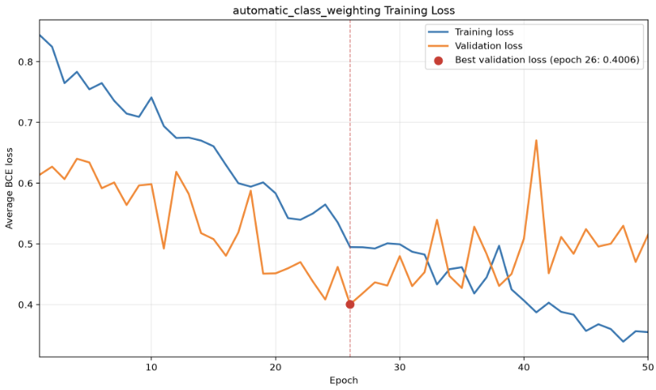

[← Back to the Judo Clipper case study](/blog/judo-clipper)

## Hypothesis

The training split contains 1,112 no-attempt clips and 618 throw-attempt clips, meaning that the positive throw-attempt class is underrepresented.

Introducing automatic positive-class weighting to the loss function will cause errors on throw-attempt clips to contribute more strongly to the training objective. This could reduce bias towards the majority no-attempt class and improve attempt classification performance.

The automatic positive-class weight will be calculated using only the training split:

`negative training samples / positive training samples = 1,112 / 618 ≈ 1.80`

## Architecture and Configurations

The model architecture and training configurations are the same as those used in the bidirectional LSTM with gradient clipping experiment.

The only change is that automatic positive-class weighting is applied to the training loss. The positive-class weight was calculated using only the class counts from the training split and resolved to approximately 1.80.

This means that errors on throw-attempt clips contribute more strongly to the training objective than errors on no-attempt clips.

### Architecture Configurations

| Hyperparameter | Value | Description |
| --- | ---: | --- |
| LSTM Hidden Size | 128 | Number of features in each directional LSTM hidden state |
| LSTM Layers | 2 | Number of stacked recurrent layers |
| Bidirectional | True | Processes each sequence in both temporal directions |
| Classifier Hidden Size | 64 | Intermediate projection before the final logit |
| Dropout Rate | 0.30 | Regularization applied within the model architecture |

### Training Configurations

| Parameter | Value | Details |
| --- | ---: | --- |
| Epochs | 50 | Total passes over the training data |
| Batch Size | 32 | Number of sequences per batch |
| Learning Rate | 0.001 | Base step size for the optimizer |
| Weight Decay | 0.0001 | L2 regularization to penalize large weights |
| Maximum Gradient Norm | 1.00 | Clips the total gradient norm to limit unusually large parameter updates |
| Class Weighting Mode | Auto | Calculates the positive-class weight from the training split |
| Resolved Positive-Class Weight | 1.7994 | Training no-attempt count divided by training attempt count |

A maximum gradient norm of 1.0 was retained from the previous experiments because it improved training stability and validation performance.

Automatic positive-class weighting was used only for the training objective. Validation loss was calculated using ordinary unweighted binary cross-entropy so that checkpoint selection and validation loss remained comparable with the previous experiments.

## Dataset for Experiment

The exact same frozen dataset split that was used for all previous experiments was used for this experiment.

i.e.

The proportions were:

| **Split** | **Fraction (%)** | **Split File / Strategy** | **Details / Purpose** |
| --- | --- | --- | --- |
| **Train** | 80% | `splits/dataset_v1_stratified_seed_42.csv` (Seed: `42`) | Model training and parameter updates |
| **Validation** | 10% | `splits/dataset_v1_stratified_seed_42.csv` (Seed: `42`) | Hyperparameter tuning & threshold calibration |
| **Test** | 10% | `splits/dataset_v1_stratified_seed_42.csv` (Seed: `42`) | Unbiased final performance evaluation |

Given that the dataset contained 2,163 clips, the raw counts of the split were:

| **Class** | **Training** | **Validation** | **Test** | **Total** |
| --- | ---: | ---: | ---: | ---: |
| No attempt | 1,112 | 139 | 139 | 1,390 |
| Throw attempt | 618 | 77 | 78 | 773 |
| **Overall total** | **1,730** | **216** | **217** | **2,163** |

## Results

### Results of Training

#### Diagram of Training Losses

The training loss shown in the diagram is the weighted training objective, while the validation loss is ordinary unweighted binary cross-entropy. Therefore, the numerical values of the two curves should not be compared directly.

### Results of Evaluation Using the Validation Dataset Split

#### Evaluation Policy

The exact same evaluation policy that was used for the previous experiments was used for this experiment.

i.e.

The model returns raw logits. During evaluation, sigmoid converts the logits into probabilities. A threshold of 0.50 was used as the initial reference, after which the validation threshold was selected by maximising attempt F1 according to the predefined tie-breaking policy. This selected a threshold of 0.55.

#### Results

The model was evaluated on the validation split using the checkpoint from the epoch with the lowest validation loss, which was epoch 26.

#### Model & Checkpoint Configuration

| Parameter | Value |
| :--- | :--- |
| **Split** | validation |
| **Checkpoint** | best |
| **Checkpoint Epoch** | 26 |
| **Checkpoint Validation Loss** | 0.4006 |
| **Classification Threshold** | 0.5500 *(validation-selected)* |

#### Dataset Counts

| Metric | Count |
| :--- | ---: |
| **Total Samples** | 216 |
| **Actual Attempts** | 77 |
| **Actual No-Attempts** | 139 |

#### Confusion Matrix

##### Breakdown

| Metric | Count |
| :--- | ---: |
| **True Positives (TP)** | 64 |
| **True Negatives (TN)** | 119 |
| **False Positives (FP)** | 20 |
| **False Negatives (FN)** | 13 |

##### 2×2 Matrix View

| | **Predicted: Attempt** | **Predicted: No-Attempt** |
| :--- | :---: | :---: |
| **Actual: Attempt** | **64** *(TP)* | **13** *(FN)* |
| **Actual: No-Attempt** | **20** *(FP)* | **119** *(TN)* |

#### Classification Metrics

##### Overall Performance

- **Accuracy:** `0.8472` (84.72%)
- **Macro F1:** `0.8366`

##### Per-Class Metrics

| Class | Precision | Recall | F1-Score |
| :--- | :---: | :---: | :---: |
| **Attempt** | 0.7619 | 0.8312 | 0.7950 |
| **No-Attempt** | 0.9015 | 0.8561 | 0.8782 |

#### Comparison of Automatic Class Weighting Results vs Previous Model

| **Metric** | **Bidirectional + Gradient Clipping** | **With Automatic Class Weighting** | **Change** |
| --- | ---: | ---: | ---: |
| Best epoch | 22 | 26 | N/A |
| Best validation loss | 0.3990 | 0.4006 | +0.0016 |
| Selected threshold | 0.34 | 0.55 | +0.21 |
| Accuracy | 0.8333 | 0.8472 | +0.0139 |
| Attempt precision | 0.7531 | 0.7619 | +0.0088 |
| Attempt recall | 0.7922 | 0.8312 | +0.0390 |
| Attempt F1 | 0.7722 | 0.7950 | +0.0228 |
| Macro F1 | 0.8204 | 0.8366 | +0.0162 |
| TP | 61 | 64 | +3 |
| TN | 119 | 119 | 0 |
| FP | 20 | 20 | 0 |
| FN | 16 | 13 | −3 |

## Analysis of Results

Automatic positive-class weighting improved validation classification performance compared with the bidirectional model without class weighting.

Attempt F1 increased from 0.7722 to 0.7950, attempt recall increased from 0.7922 to 0.8312, and macro F1 increased from 0.8204 to 0.8366. Overall accuracy also increased from 0.8333 to 0.8472.

The automatically weighted model correctly identified three additional attempt clips without increasing the number of false positives. True positives increased from 61 to 64, while false negatives decreased from 16 to 13. False positives remained unchanged at 20.

Best unweighted validation loss increased slightly from 0.3990 to 0.4006. However, this difference was very small, while the classification metrics at the validation-selected threshold improved. Under the predefined model-selection policy, which prioritises attempt F1, the automatically weighted model is the stronger candidate.

These results support the hypothesis that automatic positive-class weighting can improve the model's ability to identify the underrepresented throw-attempt class.

### Analysis of Training Curve

The training and validation curves represent different objectives in this experiment. Training loss is calculated using weighted binary cross-entropy, while validation loss is calculated using ordinary unweighted binary cross-entropy. Their numerical values should therefore not be compared directly.

The weighted training loss generally decreased throughout the experiment, showing that the model continued to improve on the training objective.

The lowest unweighted validation loss occurred at epoch 26. After this point, the weighted training loss continued to decrease while the validation loss became more volatile and broadly worsened. This suggests that the model began to overfit the training data after its best epoch.

The best-checkpoint policy handled this correctly by retaining the model state from epoch 26 rather than using the final model state from epoch 50.

The curve does not suggest that increasing the training budget beyond 50 epochs would improve validation performance.

### Analysis of Evaluation on Validation Data

The main improvement was increased detection of throw attempts. The model correctly classified 64 of the 77 attempt clips, producing an attempt recall of 0.8312.

Compared with the bidirectional model without automatic weighting, this model gained three true positives without producing any additional false positives. This resulted in improvements to attempt recall, attempt precision, attempt F1, macro F1, and overall accuracy.

The validation-selected threshold increased from 0.34 to 0.55. This is not inherently a concern because class weighting changes the learned logits and their probability distribution. As with every experiment, the threshold was selected independently using only the validation split.

## Decision and Next Steps

The bidirectional LSTM with gradient clipping and automatic positive-class weighting achieved the highest validation attempt F1, macro F1, and overall accuracy of all the experiments.

It is therefore selected as the final model.

No further architecture or hyperparameter experiments will be conducted. The selected checkpoint from epoch 26 and its validation-selected classification threshold of 0.55 will now be frozen.

The selected model will be evaluated once on the held-out test split. The test result will be reported as the final unbiased evaluation and will not be used to return to model selection.

After final test evaluation, the selected model will be exported as a clean production release bundle. The production inference wrapper will load the release bundle and accept one `[210, 68]` float32 input array.
