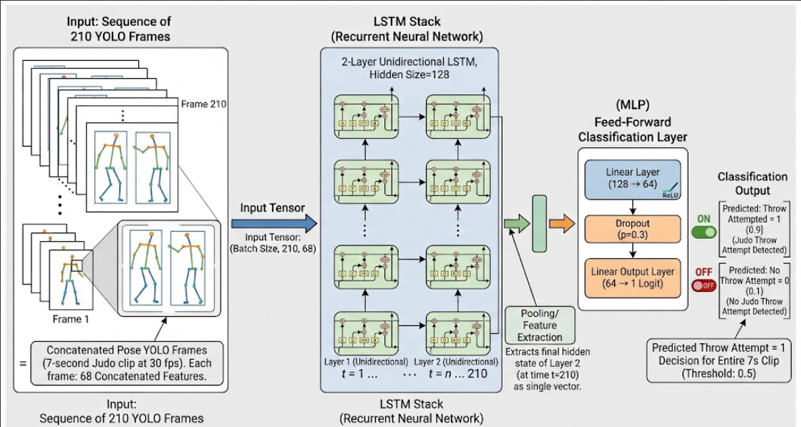
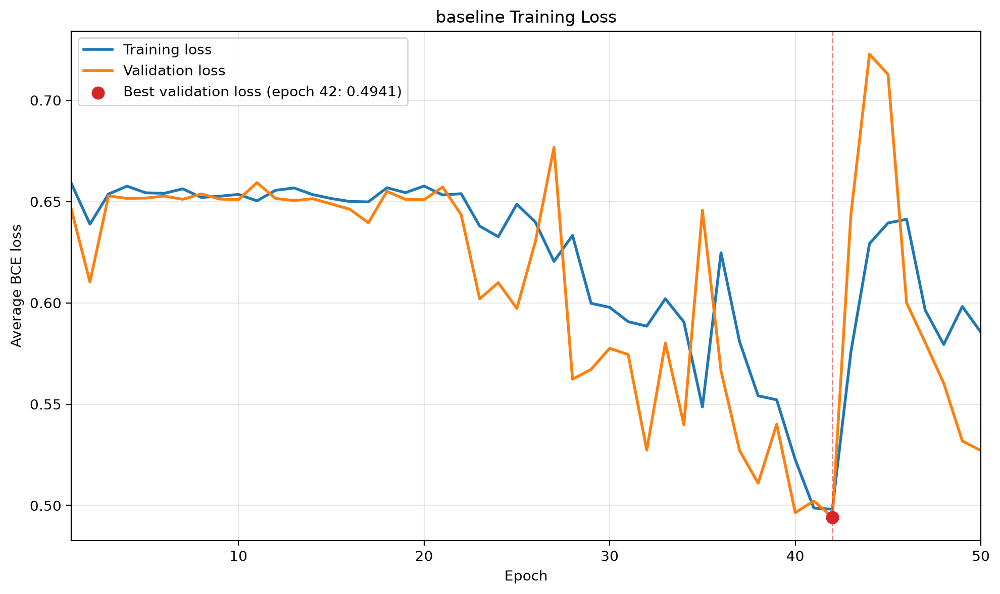

[← Back to the Judo Clipper case study](/blog/judo-clipper)

## Brief Summary of Model

The model is an LSTM with a feed-forward classification head. Its purpose is to determine whether a given input clip of a judo match contains at least one throw attempt.

The LSTM receives a sequence of 210 concatenated player pose vectors, each containing 68 features, with one vector for each frame in a 7-second clip. It produces one raw logit representing whether the complete clip contains a throw attempt. During evaluation or inference, the logit is converted into a probability and then into a binary prediction: throw attempt = 1 and no throw attempt = 0.

## Architecture and Configurations

The baseline model consists of a two-layer LSTM followed by a feed-forward classification head. The classification head projects the LSTM's final hidden-state representation into one raw logit for the complete clip.

| Hyperparameter | Value | Description |
| --- | ---: | --- |
| LSTM Hidden Size | 128 | Balances representational capacity and overfitting |
| LSTM Layers | 2 | Captures hierarchical temporal features |
| Bidirectional | False | Processes sequences strictly forward in time |
| Classifier Hidden Size | 64 | Intermediate projection before final logits |
| Dropout Rate | 0.30 | Regularization for dense classification layers |

### Training Configurations

| Parameter | Value | Details |
| --- | ---: | --- |
| Epochs | 50 | Total passes over the training data |
| Batch Size | 32 | Number of sequences per batch |
| Learning Rate | 0.001 | Base step size for the optimizer |
| Weight Decay | 0.0001 | L2 regularization to penalize large weights |

## Dataset Split

The dataset was divided into stratified training, validation, and test splits using scikit-learn with a random seed of 42. The resulting split assignments were frozen and persisted in `splits/dataset_v1_stratified_seed_42.csv` so that every experiment uses exactly the same samples.

The proportions were:

| **Split** | **Fraction (%)** | **Manifest File / Strategy** | **Details / Purpose** |
| --- | --- | --- | --- |
| **Train** | 80% | `splits/dataset_v1_stratified_seed_42.csv` (Seed: `42`) | Model training and parameter updates |
| **Validation** | 10% | `splits/dataset_v1_stratified_seed_42.csv` (Seed: `42`) | Hyperparameter tuning & threshold calibration |
| **Test** | 10% | `splits/dataset_v1_stratified_seed_42.csv` (Seed: `42`) | Unbiased final performance evaluation |

Given that the dataset contained 2,163 clips, the raw counts of the split were:

| **Class** | **Training** | **Validation** | **Test** | **Total** |
| --- | ---: | ---: | ---: | ---: |
| No throw | 1,112 | 139 | 139 | 1,390 |
| Throw attempt | 618 | 77 | 78 | 773 |
| **Overall total** | **1,730** | **216** | **217** | **2,163** |

## Results

### Results of Training

#### Diagram of Training Losses

### Results of Evaluation Using the Validation Dataset Split

#### Evaluation Policy

The model returns raw logits. During evaluation, sigmoid converts logits into probabilities. A threshold of 0.50 was used as the initial reference, after which the validation threshold was selected by maximising attempt F1 according to the predefined tie-breaking policy. This selected a threshold of 0.53.

#### Results

**Model & Checkpoint Configuration**

| Parameter | Value |
| :--- | :--- |
| **Split** | validation |
| **Checkpoint** | best |
| **Checkpoint Epoch** | 42 |
| **Checkpoint Validation Loss** | 0.4941 |
| **Classification Threshold** | 0.5300 *(validation-selected)* |

**Dataset Counts**

| Metric | Count |
| :--- | :--- |
| **Total Samples** | 216 |
| **Actual Attempts** | 77 |
| **Actual No-Attempts** | 139 |

#### Confusion Matrix

**Breakdown**

| Metric | Count |
| :--- | :--- |
| **True Positives (TP)** | 61 |
| **True Negatives (TN)** | 105 |
| **False Positives (FP)** | 34 |
| **False Negatives (FN)** | 16 |

**2×2 Matrix View**

| | **Predicted: Attempt** | **Predicted: No-Attempt** |
| :--- | :---: | :---: |
| **Actual: Attempt** | **61** *(TP)* | **16** *(FN)* |
| **Actual: No-Attempt** | **34** *(FP)* | **105** *(TN)* |

#### Classification Metrics

**Overall Performance**

- **Accuracy:** `0.7685` (76.85%)
- **Macro F1:** `0.7585`

**Per-Class Metrics**

| Class | Precision | Recall | F1-Score |
| :--- | :---: | :---: | :---: |
| **Attempt** | 0.6421 | 0.7922 | 0.7093 |
| **No-Attempt** | 0.8678 | 0.7554 | 0.8077 |

## Analysis of Results

Overall, the validation metrics and the shape of the training and validation loss curves indicate that the LSTM provides a credible baseline, although controlled architecture and hyperparameter experiments may improve its performance.

### Analysis of Training Curve

There are 3 main points of interest regarding the curve of training losses:

- The losses showed little apparent improvement during approximately the first 20–23 epochs, after which optimisation began producing clearer reductions.
- The erratic spike after the 42nd epoch
- The model doesn't seem to be overfitting (the training and validation curves are moving together)

These findings could suggest that the model may be suffering from exploding gradients.

### Analysis of Evaluation on Validation Data

The false positives are the main concern given the intended use for this model and 34 is slightly higher than desired for a baseline. However, the true positive count, true negative count, and macro F1 score are promising.

The F1 score for the no attempt category being slightly higher than for the attempt category was expected and isn't currently of concern.

## Next Steps

There are 2 relatively obvious next steps:

- Implementing gradient clipping to address the potential exploding gradient issue.
- Trying a bidirectional LSTM (as the model is processing the entire clip in post anyway)

These should both be tested as their own experiments and evaluated against the baseline.
