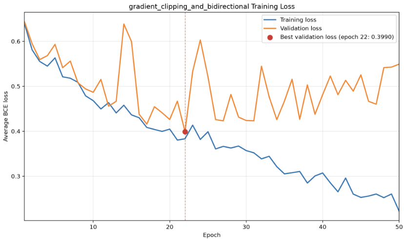

[← Back to the Judo Clipper case study](/blog/judo-clipper)

## Hypothesis

If the model architecture implements a bidirectional LSTM instead of a unidirectional LSTM, classification performance will improve.

## Architecture and Configurations

The only difference between this experiment's model architecture and the architecture used in the gradient-clipping experiment is that this model uses a bidirectional LSTM.

The bidirectional LSTM processes each sequence in both temporal directions. The final forward and backward hidden states are concatenated before being passed into the feed-forward classification head.

Everything else remains the same.

### Architecture Configurations

| Hyperparameter | Value | Description |
| --- | ---: | --- |
| LSTM Hidden Size | 128 | Number of features in each directional LSTM hidden state |
| LSTM Layers | 2 | Number of stacked recurrent layers |
| Bidirectional | True | Processes each sequence in both temporal directions |
| Classifier Hidden Size | 64 | Intermediate projection before the final logit |
| Dropout Rate | 0.30 | Regularization applied within the model architecture |

### Training Configurations

| Parameter | Value | Details |
| --- | ---: | --- |
| Epochs | 50 | Total passes over the training data |
| Batch Size | 32 | Number of sequences per batch |
| Learning Rate | 0.001 | Base step size for the optimizer |
| Weight Decay | 0.0001 | L2 regularization to penalize large weights |
| Maximum Gradient Norm | 1.00 | Clips the total gradient norm to limit unusually large parameter updates |

A maximum gradient norm of 1.0 was selected as a conventional initial value for recurrent neural network training. This value was kept fixed throughout the experiment.

## Dataset for Experiment

The exact same dataset split that was used for the baseline and gradient-clipping experiments was used for this experiment.

i.e.

The proportions were:

| **Split** | **Fraction (%)** | **Manifest File / Strategy** | **Details / Purpose** |
| --- | --- | --- | --- |
| **Train** | 80% | `splits/dataset_v1_stratified_seed_42.csv` (Seed: `42`) | Model training and parameter updates |
| **Validation** | 10% | `splits/dataset_v1_stratified_seed_42.csv` (Seed: `42`) | Hyperparameter tuning & threshold calibration |
| **Test** | 10% | `splits/dataset_v1_stratified_seed_42.csv` (Seed: `42`) | Unbiased final performance evaluation |

Given that the dataset contained 2,163 clips, the raw counts of the split were:

| **Class** | **Training** | **Validation** | **Test** | **Total** |
| --- | ---: | ---: | ---: | ---: |
| No attempt | 1,112 | 139 | 139 | 1,390 |
| Throw attempt | 618 | 77 | 78 | 773 |
| **Overall total** | **1,730** | **216** | **217** | **2,163** |

## Results

### Results of Training

#### Diagram of Training Losses

### Results of Evaluation Using the Validation Dataset Split

#### Evaluation Policy

The exact same evaluation policy that was used for the baseline and gradient-clipping experiments was used for this experiment.

i.e.

The model returns raw logits. During evaluation, sigmoid converts the logits into probabilities. A threshold of 0.50 was used as the initial reference, after which the validation threshold was selected by maximising attempt F1 according to the predefined tie-breaking policy. This selected a threshold of 0.34.

#### Results

The model was evaluated on the validation split using the checkpoint from the epoch with the lowest validation loss, which was epoch 22.

#### Model & Checkpoint Configuration

| Parameter | Value |
| :--- | :--- |
| **Split** | validation |
| **Checkpoint** | best |
| **Checkpoint Epoch** | 22 |
| **Checkpoint Validation Loss** | 0.3990 |
| **Classification Threshold** | 0.3400 *(validation-selected)* |

#### Dataset Counts

| Metric | Count |
| :--- | ---: |
| **Total Samples** | 216 |
| **Actual Attempts** | 77 |
| **Actual No-Attempts** | 139 |

#### Confusion Matrix

##### Breakdown

| Metric | Count |
| :--- | ---: |
| **True Positives (TP)** | 61 |
| **True Negatives (TN)** | 119 |
| **False Positives (FP)** | 20 |
| **False Negatives (FN)** | 16 |

##### 2×2 Matrix View

| | **Predicted: Attempt** | **Predicted: No-Attempt** |
| :--- | :---: | :---: |
| **Actual: Attempt** | **61** *(TP)* | **16** *(FN)* |
| **Actual: No-Attempt** | **20** *(FP)* | **119** *(TN)* |

#### Classification Metrics

##### Overall Performance

- **Accuracy:** `0.8333` (83.33%)
- **Macro F1:** `0.8204`

##### Per-Class Metrics

| Class | Precision | Recall | F1-Score |
| :--- | :---: | :---: | :---: |
| **Attempt** | 0.7531 | 0.7922 | 0.7722 |
| **No-Attempt** | 0.8815 | 0.8561 | 0.8686 |

#### Comparison of Bidirectional Results vs Gradient-Clipped Unidirectional Model

| **Metric** | **Unidirectional + Gradient Clipping** | **Bidirectional + Gradient Clipping** | **Change** |
| --- | ---: | ---: | ---: |
| Best epoch | 40 | 22 | N/A |
| Best validation loss | 0.4298 | 0.3990 | −0.0308 |
| Selected threshold | 0.45 | 0.34 | −0.11 |
| Accuracy | 0.8241 | 0.8333 | +0.0092 |
| Attempt precision | 0.7468 | 0.7531 | +0.0063 |
| Attempt recall | 0.7662 | 0.7922 | +0.0260 |
| Attempt F1 | 0.7564 | 0.7722 | +0.0158 |
| Macro F1 | 0.8094 | 0.8204 | +0.0110 |
| TP | 59 | 61 | +2 |
| TN | 119 | 119 | 0 |
| FP | 20 | 20 | 0 |
| FN | 18 | 16 | −2 |

## Analysis of Results

Changing from a unidirectional LSTM to a bidirectional LSTM improved validation performance.

The best validation loss decreased from 0.4298 to 0.3990, while attempt F1 increased from 0.7564 to 0.7722 and macro F1 increased from 0.8094 to 0.8204. Overall accuracy also increased from 0.8241 to 0.8333.

The bidirectional model correctly identified two additional attempt clips without increasing the number of false positives. This increased attempt recall from 0.7662 to 0.7922 while also producing a small increase in attempt precision.

These results support the hypothesis that processing the complete clip in both temporal directions can improve classification performance. However, the improvement was smaller than the improvement produced by introducing gradient clipping.

### Analysis of Training Curve

The lowest validation loss occurred at epoch 22. After this point, the training and validation loss curves began to diverge, with training loss continuing to decrease while validation loss became more volatile.

This suggests that the model began to overfit the training data after its best epoch. The best-checkpoint policy handled this correctly by retaining the model state from epoch 22 rather than using the final model state from epoch 50.

The curve does not suggest that increasing the training budget beyond 50 epochs would improve validation performance.

### Analysis of Evaluation on Validation Data

The bidirectional model produced 61 true positives and 20 false positives. Compared with the clipped unidirectional model, it correctly classified two additional attempt clips without incorrectly classifying any additional no-attempt clips.

This represents a favourable improvement because attempt recall increased while false-positive control was maintained. The bidirectional model therefore performed better than the clipped unidirectional model across best validation loss, attempt F1, macro F1, and overall accuracy.

## Next Steps

Given that the bidirectional LSTM improved validation performance, bidirectionality will be retained alongside gradient clipping for subsequent experiments.

The bidirectional LSTM with gradient clipping is currently the strongest model based on validation performance.

If one final controlled experiment is conducted, it should test automatic positive-class weighting on this architecture while keeping bidirectionality, gradient clipping, the dataset split, and all other configurations unchanged. After this final experiment, the winning model will be selected using validation results before being evaluated once on the held-out test split.
