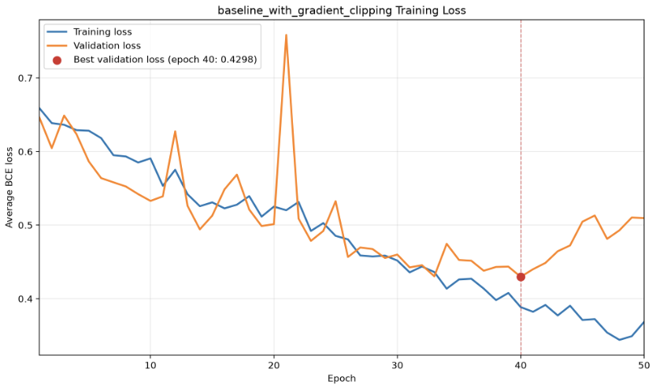

[← Back to the Judo Clipper case study](/blog/judo-clipper)

## Hypothesis

The baseline model could potentially be suffering from exploding gradients. Gradient clipping could mitigate this potential issue and stabilize training.

## Architecture and Configurations

The overall architecture and configurations are exactly the same as the baseline model.

The only change is that the training loop applies gradient-norm clipping after backpropagation and before each optimiser step. When the total gradient norm exceeds 1.0, the gradients are scaled down before the model parameters are updated.

### Training Configurations

| Parameter | Value | Details |
| --- | ---: | --- |
| Epochs | 50 | Total passes over the training data |
| Batch Size | 32 | Number of sequences per batch |
| Learning Rate | 0.001 | Base step size for the optimizer |
| Weight Decay | 0.0001 | L2 regularization to penalize large weights |
| Maximum Gradient Norm | 1.00 | Clips the total gradient norm to limit unusually large parameter updates |

A maximum gradient norm of 1.0 was selected as a conventional initial value for recurrent neural network training. This value was kept fixed throughout the experiment.

## Dataset for Experiment

The exact same dataset split that was used for the baseline model was used for this experiment.

i.e.

The proportions were:

| **Split** | **Fraction (%)** | **Manifest File / Strategy** | **Details / Purpose** |
| --- | --- | --- | --- |
| **Train** | 80% | `splits/dataset_v1_stratified_seed_42.csv` (Seed: `42`) | Model training and parameter updates |
| **Validation** | 10% | `splits/dataset_v1_stratified_seed_42.csv` (Seed: `42`) | Hyperparameter tuning & threshold calibration |
| **Test** | 10% | `splits/dataset_v1_stratified_seed_42.csv` (Seed: `42`) | Unbiased final performance evaluation |

Given that the dataset contained 2,163 clips, the raw counts of the split were:

| **Class** | **Training** | **Validation** | **Test** | **Total** |
| --- | ---: | ---: | ---: | ---: |
| No throw | 1,112 | 139 | 139 | 1,390 |
| Throw attempt | 618 | 77 | 78 | 773 |
| **Overall total** | **1,730** | **216** | **217** | **2,163** |

## Results

### Results of Training

#### Diagram of Training Losses

### Results of Evaluation Using the Validation Dataset Split

#### Evaluation Policy

The exact same evaluation policy that was used for the baseline model evaluation was used for this experiment.

i.e.

The model returns raw logits. During evaluation, sigmoid converts logits into probabilities. A threshold of 0.50 was used as the initial reference, after which the validation threshold was selected by maximising attempt F1 according to the predefined tie-breaking policy. This selected a threshold of 0.45.

#### Results

The model was evaluated on the validation split using the checkpoint from the epoch with the lowest validation loss, which was epoch 40.

#### Model & Checkpoint Configuration

| Parameter | Value |
| :--- | :--- |
| **Split** | validation |
| **Checkpoint** | best |
| **Checkpoint Epoch** | 40 |
| **Checkpoint Validation Loss** | 0.4298 |
| **Classification Threshold** | 0.4500 *(validation-selected)* |

#### Dataset Counts

| Metric | Count |
| :--- | ---: |
| **Total Samples** | 216 |
| **Actual Attempts** | 77 |
| **Actual No-Attempts** | 139 |

#### Confusion Matrix

##### Breakdown

| Metric | Count |
| :--- | ---: |
| **True Positives (TP)** | 59 |
| **True Negatives (TN)** | 119 |
| **False Positives (FP)** | 20 |
| **False Negatives (FN)** | 18 |

##### 2×2 Matrix View

| | **Predicted: Attempt** | **Predicted: No-Attempt** |
| :--- | :---: | :---: |
| **Actual: Attempt** | **59** *(TP)* | **18** *(FN)* |
| **Actual: No-Attempt** | **20** *(FP)* | **119** *(TN)* |

#### Classification Metrics

##### Overall Performance

- **Accuracy:** `0.8241` (82.41%)
- **Macro F1:** `0.8094`

##### Per-Class Metrics

| Class | Precision | Recall | F1-Score |
| :--- | :---: | :---: | :---: |
| **Attempt** | 0.7468 | 0.7662 | 0.7564 |
| **No-Attempt** | 0.8686 | 0.8561 | 0.8623 |

#### Comparison of Gradient Clipping Results vs Baseline

| **Metric** | **Original Baseline** | **With Gradient Clipping** | **Change** |
| --- | ---: | ---: | ---: |
| Best epoch | 42 | 40 | N/A |
| Best validation loss | 0.4941 | 0.4298 | −0.0643 |
| Selected threshold | 0.53 | 0.45 | −0.08 |
| Accuracy | 0.7685 | 0.8241 | +0.0556 |
| Attempt precision | 0.6421 | 0.7468 | +0.1047 |
| Attempt recall | 0.7922 | 0.7662 | −0.0260 |
| Attempt F1 | 0.7093 | 0.7564 | +0.0471 |
| Macro F1 | 0.7585 | 0.8094 | +0.0509 |
| TP | 61 | 59 | −2 |
| TN | 105 | 119 | +14 |
| FP | 34 | 20 | −14 |
| FN | 16 | 18 | +2 |

## Analysis of Results

Adding gradient-norm clipping with a maximum norm of 1.0 substantially improved the baseline model. Best validation loss decreased from 0.4941 to 0.4298, while attempt F1 increased from 0.7093 to 0.7564 and macro F1 increased from 0.7585 to 0.8094. The number of false positives fell from 34 to 20, with only a small reduction in true positives from 61 to 59. The loss curve also showed earlier and more consistent learning, although some validation volatility remained. These results support adopting gradient clipping as part of the standard training procedure for subsequent experiments.

### Analysis of Training Curve

The training curve is much more stable than it was for the baseline.

The only remaining point of interest on the curve of training losses is the divergence of the validation and training curves after 40 epochs. The divergence after epoch 40 suggests that increasing the training budget beyond 50 epochs is unlikely to improve validation performance and may increase overfitting.

### Analysis of Evaluation on Validation Data

The false positives decreased by 14 which was good and the tradeoff of losing 2 true positives is likely worth it.

## Next Steps

Given that gradient clipping improved validation performance and training stability, it will be adopted as part of the standard training procedure for subsequent experiments.

The next experiment will compare a bi-directional LSTM with the clipped unidirectional model. Gradient clipping and all other training settings will remain unchanged, isolating bi-directionality as the main experimental factor.
